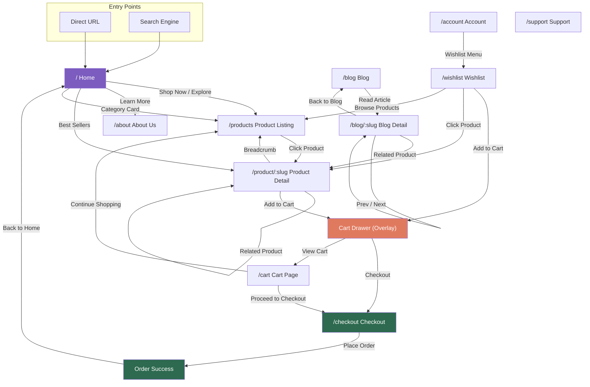
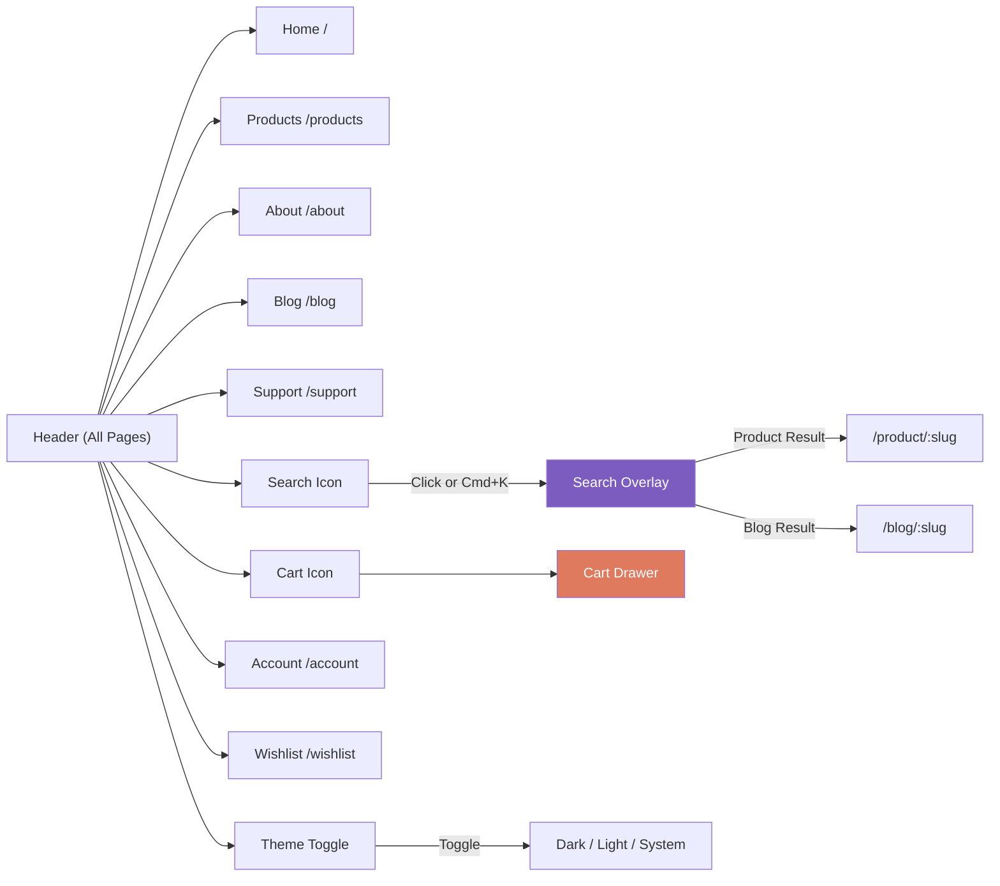
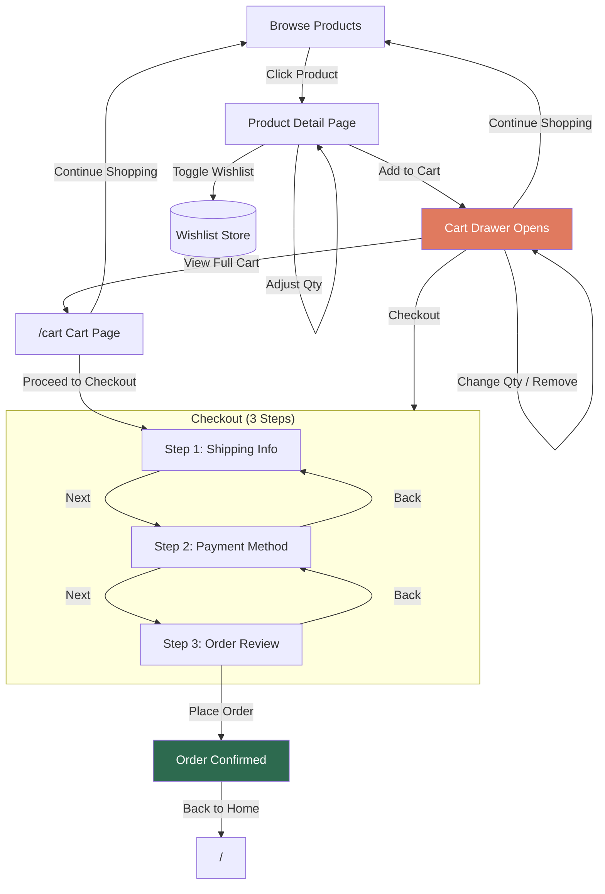
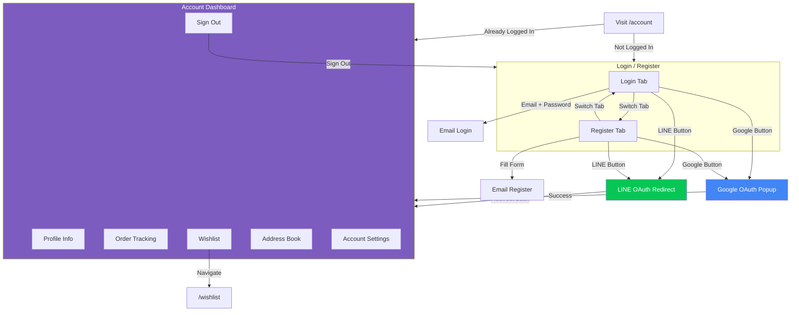
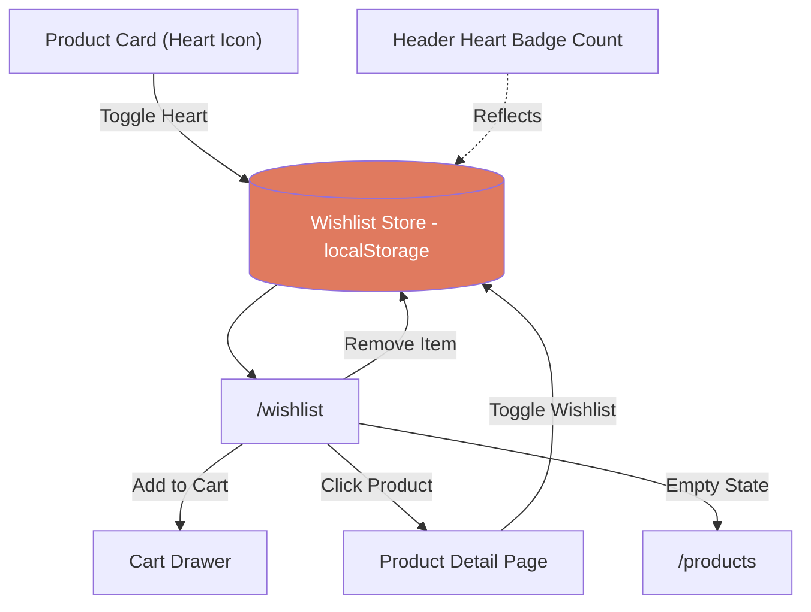
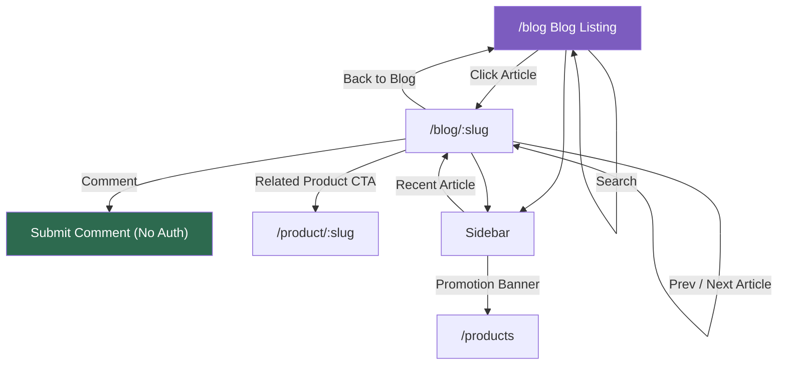
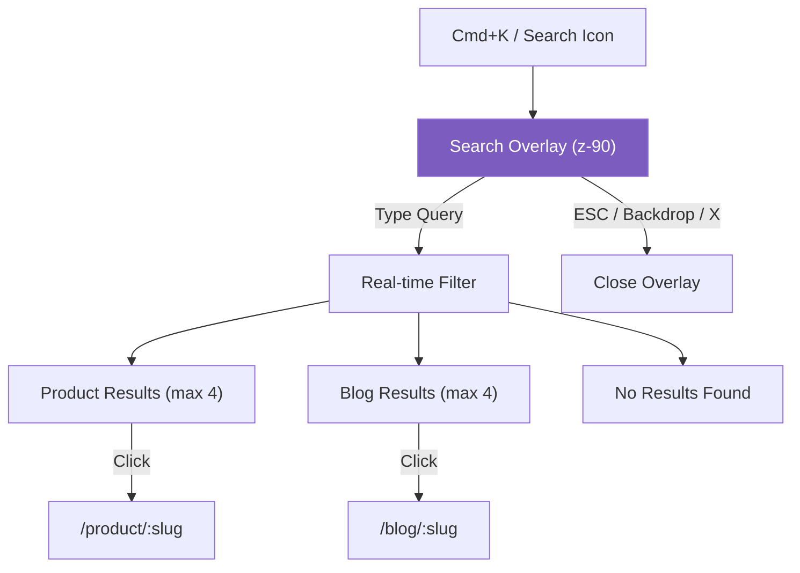
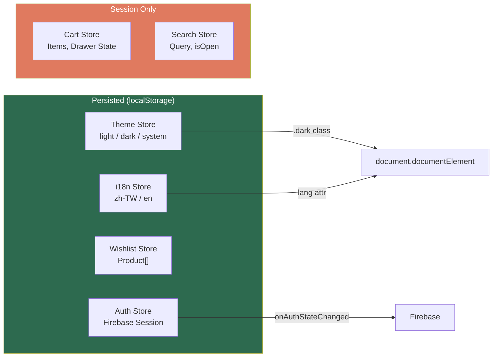
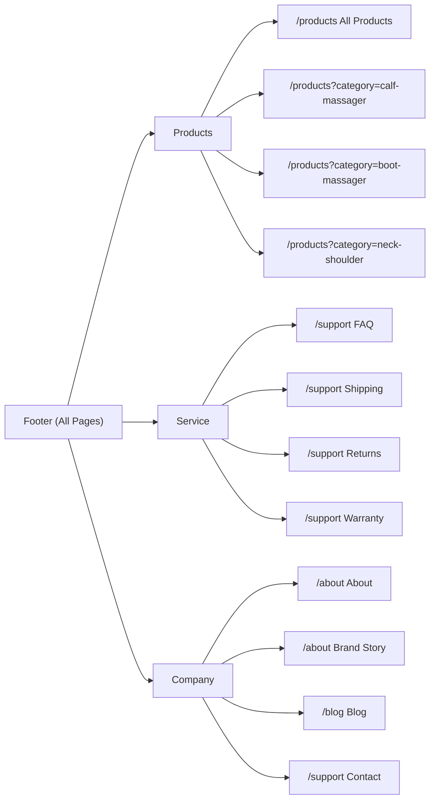

# Lunio Massager - User Flow

## Overview

---

## Global Navigation (Header)

---

## Shopping Flow

---

## Authentication Flow

---

## Wishlist Flow

---

## Blog & Content Flow

---

## Search Flow

---

## State Management

---

## Footer Navigation

